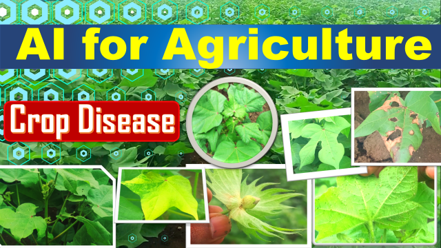

# cottonplant

  

  
  

  

# About
Leveraging the power of Deep-learning, deployed a Flask based Web application successfully capable of identifying the fresh or diseased cotton plant or leaf with 98% accuracy on validation dataset.

Currently supports 4 class labels, namely :
* Fresh cotton leaf 
* Fresh cotton plant 
* Diseased cotton leaf 
* Diseased cotton plant 
